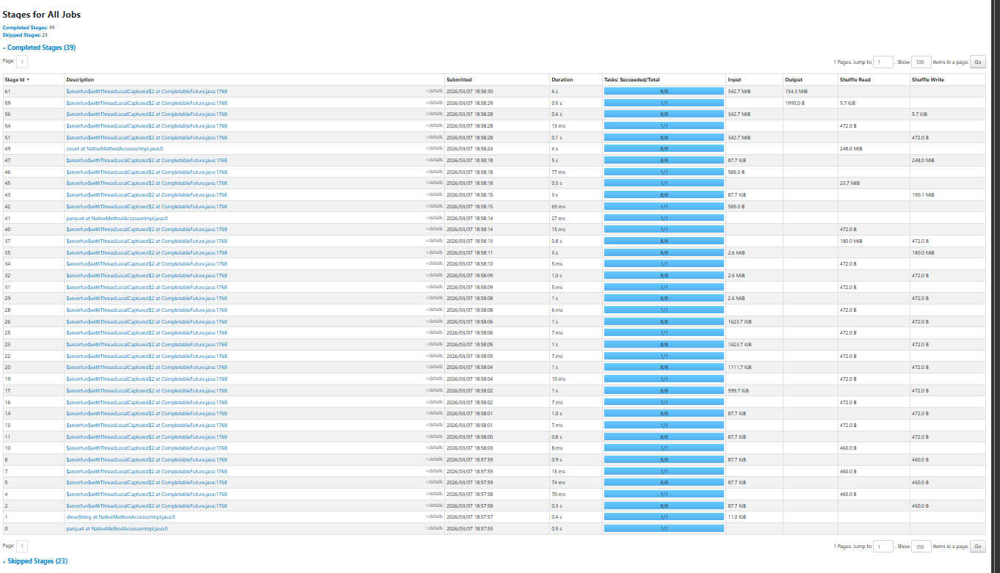
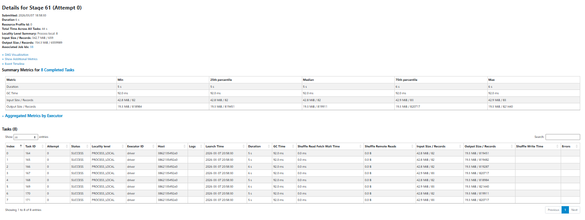

# Big-Data-Management-Project

## Running the Project

### Prerequisites
- Docker Desktop (or Docker Engine with Docker Compose)
- Verify Docker is running: `docker version`

### Run the Pipeline
Place input parquet files into `data/inbox/`, then:

```bash
docker compose build
docker compose up
```

The pipeline will automatically detect new parquet files, process and clean the data, remove duplicates, enrich with taxi zone information, and update `state/manifest.json` to track processed files.

### Adding New Data
Add new parquet files to `data/inbox/` and run `docker compose up` again. Only previously unprocessed files will be ingested — reruns are fully idempotent.

---

## 1. Correctness

### Row Counts

| Stage | Rows | Removed |
|---|---|---|
| Input (2 files) | 7,052,769 | — |
| After null timestamp check | 7,052,769 | 0 |
| After invalid timestamp order | 7,045,554 | 7,215 |
| After 24h duration filter | 7,045,518 | 36 |
| After non-positive distance | 6,856,224 | 189,294 |
| After negative fare | 6,560,441 | 295,783 |
| After negative total amount | 6,559,991 | 450 |
| After negative passenger count | 6,559,991 | 0 |
| After invalid location IDs | 6,559,991 | 0 |
| After deduplication | 6,559,989 | 2 |
| **Final output** | **6,559,989** | — |

### Bad Row Examples

**Example 1 — Invalid timestamp order (rule 2, removed 7,215 rows)**
Rows where `tpep_dropoff_datetime <= tpep_pickup_datetime`. A trip cannot end before or at the moment it starts — these indicate corrupt or test records.

**Example 2 — Non-positive trip distance (rule 4, removed 189,294 rows)**
Rows where `trip_distance <= 0`. A completed taxi trip must have a positive distance. These are likely cancelled trips or meter errors.

**Example 3 — Negative fare amount (rule 5, removed 295,783 rows)**
Rows where `fare_amount < 0`. Negative fares indicate refunds or data entry errors. Fares of exactly 0 were kept as promotional or no-charge rides may legitimately occur.

### Cleaning Rules Summary

- **Missing timestamps** — rows missing pickup or dropoff datetime removed; required for trip duration calculation.
- **Invalid timestamp order** — dropoff must be strictly after pickup.
- **Trips longer than 24 hours** — unrealistic for standard taxi trips, likely data entry errors.
- **Non-positive trip distance** — a completed trip must have positive distance.
- **Negative fare amounts** — negative fares are invalid; zero fares permitted.
- **Negative total amounts** — negative totals are invalid; zero permitted.
- **Negative passenger counts** — only clearly invalid negatives removed. A stricter rule (>= 1) was tested but removed over 1M rows, suggesting the field is unreliable.
- **Invalid location IDs** — `PULocationID` and `DOLocationID` must be positive integers per dataset specification.

### Deduplication

Duplicates were identified using a 6-column composite key:

| Column | Reason |
|---|---|
| `tpep_pickup_datetime` | When the trip started |
| `tpep_dropoff_datetime` | When the trip ended |
| `PULocationID` | Where the trip started |
| `DOLocationID` | Where the trip ended |
| `trip_distance` | Physical length of trip |
| `fare_amount` | Base price of trip |

2 duplicate rows were removed across the 2-month dataset.

---

## 2. Performance

### Runtime
Full pipeline runtime: **42.29 seconds** (2 input files, 6,559,989 output rows, 8 CPU cores)

### Spark UI — Jobs and Stage Durations


### Spark UI — Shuffle Read/Write


Notable stages:
- **Stage 61** — 6s, 342.7 MiB input, 154.3 MiB output — `trips_enriched.parquet` write
- **Stage 49** — 4s, 248.0 MiB shuffle write — `payment_summary` aggregation
- **Stage 43** — 3s, 190.1 MiB shuffle write — broadcast join stage

### Optimizations

**Optimization 1 — Broadcast join for zone lookup**

The taxi zone lookup table contains only 265 rows. Without optimization, Spark would shuffle the full 6.5M row trips dataset across all partitions to perform the join. Using `F.broadcast()` copies the small lookup table to every partition instead, so the trips data never moves. This eliminates the shuffle entirely for the join operation.

**Optimization 2 — Reduced shuffle partitions**

Spark's default `spark.sql.shuffle.partitions` is 200. With 8 CPU cores processing ~6.5M rows, the default creates 192 near-empty partitions after each shuffle, each requiring a separate task launch with minimal actual work. Setting the value to 8 matches the available core count, ensuring each core receives one full partition and eliminating wasted task overhead.

**Optimization 3 — DataFrame caching**

After enrichment, the final DataFrame is used three times: `df.count()`, `summary_table(df)`, and `df.write()`. Without caching, Spark recomputes the entire pipeline: extraction, cleaning, deduplication, enrichment, from scratch for each action. Adding `df.cache()` after enrichment materializes the result in memory on the first action, and the subsequent two operations read from cache. The 23 skipped stages visible in the Spark UI confirm the cache was effective.

---

## 3. Scenario — Secondary Output: Payment Summary

A secondary output `data/outbox/payment_summary.parquet` is produced on every run, recomputed from the full enriched dataset. It aggregates trip statistics by payment type and pickup month.

### Schema

| Column | Description |
|---|---|
| `payment_type` | Integer payment code (see below) |
| `pickup_year_month` | Month in `yyyy-MM` format |
| `trip_count` | Total number of trips |
| `avg_fare_amount` | Average fare for the period |
| `total_amount` | Sum of total_amount for the period |

### Payment Type Codes

| Code | Description |
|---|---|
| 0 | Unknown |
| 1 | Credit card |
| 2 | Cash |
| 3 | No charge |
| 4 | Dispute |
| 5 | Unknown |
| 6 | Voided trip |

### Implementation Notes

`payment_summary.parquet` uses `mode("overwrite")` — it is always a fresh, complete summary of all data processed so far. `trips_enriched.parquet` uses `mode("append")` to accumulate trip records across incremental runs. The manifest records each processed input file with filename, ingestion timestamp, and file size, and tracks total rows written at the run level.